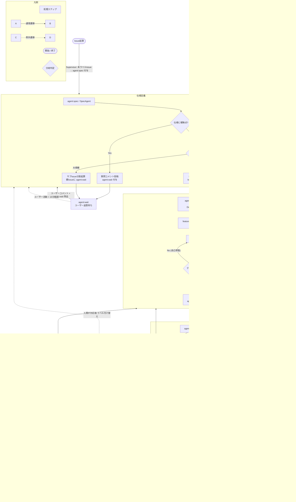

# nuage-agent

`nuage-agent` は、Claude Code や Antigravity CLI (`agy` / Gemini) などの自律型LLM CLIとGitHub Issue/PR駆動の、ステートレスかつ軽量な自動開発パイプラインである。

対象となるリポジトリ（`nuage-cluster`, `pechka` など）を定期的にクロールし、Issue/PRラベルとコメントをトリガーとして、仕様定義・開発・コードレビュー・QAの各エージェントを自動的にシェル経由で起動・実行する。

---

## 主な特徴

1. **完全ステートレス設計**
   状態管理のためのデータベース（DB）を持たない。「Issue/PRのラベル」と「コメントの履歴」のみを唯一の状態として利用する。
2. **既存LLM CLIの活用**
   ファイル編集、テスト実行、Git操作（PR作成等）の自律能力を持つ **Claude Code CLI (`claude`)** や **Antigravity CLI (`agy`)** をそのままシェル経由でオーケストレーションする。
3. **repo-mapによる複数リポジトリ対応**
   リポジトリのルールや構成マップ（repo-map）を記述することで、様々な技術スタックやディレクトリ構成のリポジトリに容易に対応可能。
4. **抜け漏れ救済（Supervisor）**
   実行中ロックのタイムアウト（ハング状態）、自己修正の無限ループ、ラベルが剥がれた状態のIssueなどをバックグラウンドで監視・修復し、例外時には自動で人間へボールを引き渡す。

---

## 状態遷移フロー (Mermaid)

Issue作成からPRマージ、差し戻しループ、およびエラー時の対応までのフローを記載する。



---

## パイプライン状態ラベル一覧

IssueおよびPRに付与される以下のラベルによって、どのエージェントにボールがあるかを一目で可視化する。

| ラベル名           | 担当フェーズ/コンポーネント       | トリガーと動作内容                                                                                                                                                                     |
| :----------------- | :-------------------------------- | :------------------------------------------------------------------------------------------------------------------------------------------------------------------------------------- |
| **`agent:spec`**   | **仕様定義 (SpecAgent)**          | すべてのIssueの開始状態。ユーザーと仕様を壁打ちし、PRDと受け入れ基準（AC）を確定させる。                                                                                               |
| **`agent:dev`**    | **開発 (DevAgent / DevPRAgent)**  | 仕様が確定したのち、ローカルテストを合格するまで自己修復を繰り返してPRを作成する（Issue担当）。また、レビュー/QAの指摘時にPRに付与され、指摘コメントを修正・再プッシュする（PR担当）。 |
| **`agent:review`** | **コードレビュー (ReviewAgents)** | 作成されたPRを、Antigravity CLI（一般・静的チェック）とClaude（意味的・設計規約チェック）の2つのエージェントで検証する。                                                               |
| **`agent:qa`**     | **検証 (QAAgent)**                | PRマージ前の最終統合・E2Eテストを行い、検証サマリを報告する。                                                                                                                          |
| **`agent:triage`** | **例外監視 (Supervisor)**         | 実行中のハングやエラー、無限ループを検知した際のフォールバック状態。人間による介入を待つ。                                                                                             |
| **`agent:wait`**   | **ユーザー待ち (Supervisor)**     | ユーザーの回答・確認待ち状態。この間はエージェント起動をスキップする。ユーザーのコメント投稿や、Supervisorによる本文編集等の検知（15分経過）で自動解除される。                         |

---

## ディレクトリ構成 (pnpm モノレポ構成)

```
/
├── package.json
├── pnpm-workspace.yaml
├── pnpm-lock.yaml
├── tsconfig.json
├── repo-map/                  # リポジトリ設定および構造マップ定義
│   ├── sandbox/               # サンドボックス検証環境用 (config.yaml, markdownマップ)
│   └── production/            # 本番運用環境用 (config.yaml, markdownマップ)
├── apps/
│   └── agent-runner/          # 対象リポジトリ群の定期クローラー兼エージェント起動デーモン
│   └── packages/
│       ├── core/              # 設定読み込み、型定義、ロガーなどの共通ユーティリティ
│       └── agents/            # エージェント定義（プロンプト・コマンド組み立てロジック）
```

---

## ローカル開発と動作確認

### 事前準備

- Node.js v24 以上
- pnpm v10 以上
- `gh` (GitHub CLI) のインストールおよびログイン (`gh auth login`)
- `claude` (Claude Code CLI) のインストール

### パイプラインの起動

本パイプラインの実行には、リポジトリ設定とMarkdownマップを含むディレクトリの指定（`--repo-map-dir` または `-d`）が**必須**である。デフォルト値や自動補完は無し。

- **Sandbox（テスト検証用）**:
  ```bash
  pnpm dev:runner -- --repo-map-dir ./repo-map/sandbox
  ```
- **Production（本番運用時）**:
  ```bash
  pnpm dev:runner -- --repo-map-dir ./repo-map/production
  ```

単発で1サイクルのみ実行してテストしたい場合は `--once` または `-o` フラグを追加する

```bash
pnpm dev:runner --once -- --repo-map-dir ./repo-map/sandbox
```

---

## サンドボックス環境での検証手順

サンドボックス環境での詳細な検証手順については、[docs/sandbox.md](file:///home/nixos/ghq/github.com/k-wa-wa/nuage-agent/docs/sandbox.md) を参照すること。
