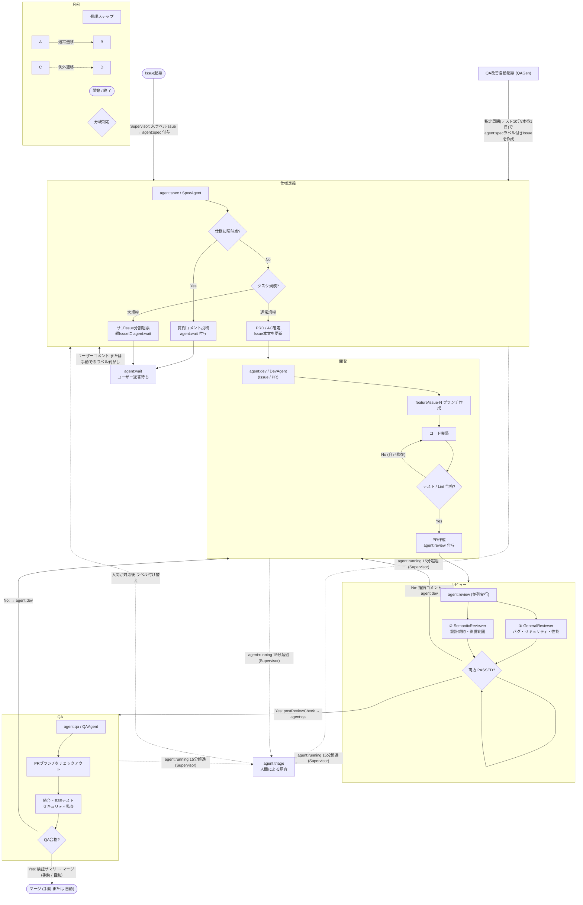

# nuage-agent

`nuage-agent` は、Claude Code や Antigravity CLI (`agy` / Gemini) などの自律型LLM CLIとGitHub Issue/PR駆動の、ステートレスかつ軽量な自動開発パイプラインである。

対象となるリポジトリ（`nuage-cluster`, `pechka` など）を定期的にクロールし、Issue/PRラベルとコメントをトリガーとして、仕様定義・開発・コードレビュー・QAの各エージェントを自動的にシェル経由で起動・実行する。

---

## 主な特徴

1. **完全ステートレス設計**
   状態管理のためのデータベース（DB）を持たない。「Issue/PRのラベル」と「コメントの履歴」のみを唯一の状態として利用する。
2. **既存LLM CLIの活用**
   ファイル編集、テスト実行、Git操作（PR作成等）の自律能力を持つ **Claude Code CLI (`claude`)** や **Antigravity CLI (`agy`)** をそのままオーケストレーションする。
3. **リソース隔離と並列実行エンジン**
   `git worktree` 機構を用い、タスクごとに隔離されたディレクトリで処理を実行する。ポートやビルド競合を起こす重いタスク（開発・QA）と、競合を起こさないタスク（仕様決定・レビュー）を検知し、それぞれに割り当てられた同時実行プールで安全に並行処理を行う。
4. **Graceful Shutdown (優雅な終了制御)**
   `SIGINT` / `SIGTERM` シグナル受信時に、動作中のエージェント CLI プロセスを強制終了させずに最後まで実行完了を待機（Drain）し、一時 worktree や GitHub 上の実行中ロックを安全に解除してからプロセスを終了する。
5. **例外監視・自動回復 (Supervisor)**
   実行中ロックのタイムアウト（ハング状態）、自己修正の無限ループ、ラベルが剥がれた状態のIssueなどをバックグラウンドで監視・修復し、例外時には自動で人間へボールを引き渡す。
6. **QA改善Issueの自律自動起票 (Proactive QA)**
   前回の起票から指定時間（テスト時10分、運用時1日等）が経過すると、テスト網羅率やLint設定の改善案を自動的に分析し、小さくマージしやすい改善Issue（`agent:spec`）を自動起票する。

---

## 状態遷移フロー (Mermaid)

Issue作成からPRマージ、差し戻しループ、およびエラー時の対応までのフロー。



---

## パイプライン状態ラベル一覧

IssueおよびPRに付与される以下のラベルによって、どのエージェントにボールがあるかを一目で可視化する。

| ラベル名           | 担当フェーズ/コンポーネント       | トリガーと動作内容                                                                                                                                                                     |
| :----------------- | :-------------------------------- | :------------------------------------------------------------------------------------------------------------------------------------------------------------------------------------- |
| **`agent:spec`**   | **仕様定義 (SpecAgent)**          | すべてのIssueの開始状態。ユーザーと仕様を壁打ちし、PRDと受け入れ基準（AC）を確定させる。                                                                                               |
| **`agent:dev`**    | **開発 (DevAgent)**               | 仕様が確定したのち、ローカルテストを合格するまで自己修復を繰り返してPRを作成する（Issue担当）。また、レビュー/QAの指摘時にPRに付与され、指摘コメントを修正・再プッシュする（PR担当）。 |
| **`agent:review`** | **コードレビュー (ReviewAgents)** | 作成されたPRを、一般・静的チェックエージェントと意味的・設計規約チェックエージェントで並行検証する。                                                                                   |
| **`agent:qa`**     | **検証 (QAAgent)**                | PRマージ前の最終統合・E2Eテストを行い、検証サマリを報告する。実行時引数で `--auto-merge` フラグが指定されている場合は、テスト合格時に自動的にマージされます。                          |
| **`agent:triage`** | **例外監視 (Supervisor)**         | 実行中のハングやエラー、無限ループを検知した際のフォールバック状態。人間による介入を待つ。                                                                                             |
| **`agent:wait`**   | **ユーザー待ち (Supervisor)**     | ユーザーの回答・確認待ち状態。この間はエージェント起動をスキップする。ユーザーによるコメント投稿（Bot以外の発言）により、自動的にラベルが解除される。                                  |

---

## ディレクトリ構成

```
/
├── package.json
├── tsconfig.json
├── docs/                      # システムアーキテクチャや各種ドキュメント
├── repo-map/                  # 対象リポジトリごとの設定および構造マップ定義
├── src/
│   ├── core/                  # 共通コア（設定ロード、ロガー、GitHub Client API、runCommand など）
│   ├── agents/                # 各自律エージェントのプロンプト定義 (spec, dev, review, qa)
│   └── runner/                # パイプライン実行エンジン（クローラー、スーパーバイザー、タスク実行プールなど）
├── workspaces/                # クローンされた対象リポジトリ群が展開されるローカル作業ディレクトリ
└── scripts/                   # 検証用サンドボックスのセットアップスクリプト等
```

---

## ローカル開発と動作確認

### 事前準備

- Node.js v24 以上
- pnpm v10 以上
- `gh` (GitHub CLI) のインストールおよびログイン (`gh auth login`)
- `claude` (Claude Code CLI) のインストール

### パイプラインの起動

本パイプラインの実行には、リポジトリ設定とMarkdownマップを含むディレクトリの指定（`--repo-map-dir` または `-d`）が**必須**である。デフォルト値や自動補完は無し。

```bash
pnpm dev:runner -- --repo-map-dir ./repo-map/production
```

単発で1サイクルのみ実行してテストしたい場合は `--once` または `-o` フラグを追加する

```bash
pnpm dev:runner --once -- --repo-map-dir ./repo-map/sandbox
```

### 詳細情報

- 並列実行、ワークスペース隔離、Graceful Shutdown、コード品質制限等の詳細なシステム動作については、[docs/architecture.md](docs/architecture.md) を参照すること。
- サンドボックス環境での具体的な検証手順については、[docs/sandbox.md](docs/sandbox.md) を参照すること。
